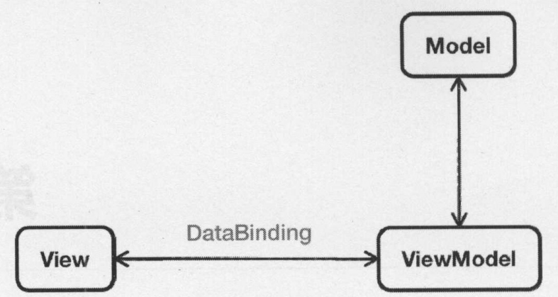

# 1.1 vue.js优点:

* 简单小巧,渐进式
* 功能
  - 解耦视图与数据
  - 可复用的组件
  - 前端路由
  - 状态管理
  - 虚拟DOM(virtual DOM)

## 1.1.1 MVVM模式

Model-View-ViewModel  
MVVM模式由MVC衍生而来.当View(视图层)数据变化时,会自动更新到ViewModel(视图模型)层,反之亦然,View与ViewModel通过双向数据绑定来建立联系

# 1.2 vue的使用

* 传统的前端开发模式:  
    JQuery + RequireJS(SeaJs) + artTemplate(doT) + Gulp(Grunt)
* vue开发模式:提升开发效率、维护成本低
* vue使用:  
    \<!-- 自动识别最新的稳定版 --\>  
    \<script src="https://unpkg.com/vue/dist/vue.min.js"\>\</script\>  
    \<!-- 使用指定版本 --\>  
    \<script src="https://unpkg.com/vue@2.1.6/dist/vue.min.js"\>\</script\>    